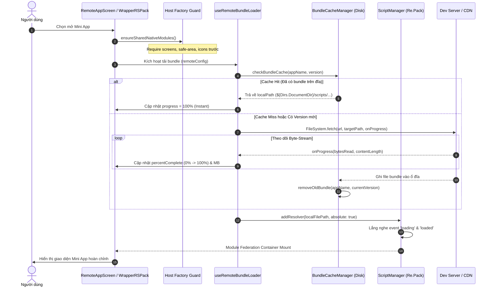

# 🚀 Kế Hoạch Triển Khai Giai Đoạn 4: Progress UX & Disk Caching

Kế hoạch kỹ thuật từng bước để tích hợp **Giai đoạn 4: Nâng cao UX & Quản lý Cache Đĩa** vào dự án SuperApp React Native (`Super-App-Showcase`).

---

## 🎯 Mục Tiêu Cốt Lõi

1. **Progress UX (Đo tiến trình thực tế 0% -> 100%):** Loại bỏ ActivityIndicator xoay tròn mù quáng, hiển thị thanh tiến trình trực quan kèm số byte đã tải và trạng thái xử lý runtime.
2. **Disk Caching & Offline-First:** Lưu trữ bundle tải về vào thư mục an toàn trên đĩa `${Dirs.DocumentDir}/scripts/`. Mở lần thứ hai với độ trễ 0ms (Cache hit), hỗ trợ mở ngay cả khi mất mạng.
3. **Cơ chế Dọn rác (Garbage Collection):** Tự động xóa các file script cũ của phiên bản trước (`removeOldBundle`) khi phiên bản mới được tải về.
4. **Host Factory Guard (`ensureSharedNativeModules`):** Đảm bảo các thư viện Native (screens, safe-area, icons, webview) được khởi tạo factory trước khi remote bundle thực thi, triệt tiêu lỗi `undefined factory` trên New Architecture.

---

## 🏗 Kiến Trúc & Luồng Dữ Liệu

---

## 📝 Danh Sách Công Việc Cần Thực Hiện (Checklist)

### Bước 1: Tích hợp thư viện Filesystem Native
- [ ] Cài đặt gói `react-native-file-access` vào [apps/host-app/package.json](file:///d:/Study/ReactNative/Super-App-Showcase/apps/host-app/package.json).
- [ ] Chạy `yarn install` và kiểm tra cấu hình tương thích React Native 0.86 New Architecture (TurboModules).

### Bước 2: Xây dựng Host Factory Guard
- [ ] Tạo file [apps/host-app/src/federation/nativeGuards.ts](file:///d:/Study/ReactNative/Super-App-Showcase/apps/host-app/src/federation/nativeGuards.ts).
- [ ] Viết hàm `ensureSharedNativeModules()` để pre-require các module:
  - `react-native-screens`
  - `react-native-safe-area-context`
  - `react-native-vector-icons`
- [ ] Gắn hàm guard vào [apps/host-app/index.js](file:///d:/Study/ReactNative/Super-App-Showcase/apps/host-app/index.js) và [apps/host-app/src/federation/WrapperRSPack.tsx](file:///d:/Study/ReactNative/Super-App-Showcase/apps/host-app/src/federation/WrapperRSPack.tsx).

### Bước 3: Xây dựng Bộ Quản Lý Cache Đĩa (Filesystem Cache & Garbage Collection)
- [ ] Tạo cấu trúc thư mục `apps/host-app/src/services/bundleCache/`.
- [ ] Tạo file `types.ts`: Khai báo interface `BundleDownloadProgress`, `CachedBundleInfo`.
- [ ] Tạo file `bundleCacheManager.ts`:
  - `ensureScriptsDirectory()`: Khởi tạo `${Dirs.DocumentDir}/scripts/`.
  - `getBundleLocalPath(appName, version)`: Quy ước tên file `${appName}_${version}.bundle`.
  - `isBundleCached(appName, version)`: Kiểm tra file tồn tại trên đĩa.
  - `downloadBundleWithProgress(url, targetPath, onProgress)`: Tải qua `FileSystem.fetch` nhận stream byte và tính phần trăm.
  - `removeOldBundle(appName, currentVersion)`: Dọn dẹp các file script cũ của cùng appName.
  - `getLatestCachedBundle(appName)`: Hỗ trợ nạp Offline-First khi không có mạng.

### Bước 4: Tích hợp Re.Pack ScriptManager Cấp Thấp
- [ ] Tạo file `repackResolver.ts`:
  - Đăng ký resolver qua `ScriptManager.shared.addResolver(...)`.
  - Trả về `{ url: Script.getFileSystemURL(localPath), absolute: true }` khi file đã nằm trên đĩa.
  - Thiết lập listener `ScriptManager.shared.on('loading')` và `ScriptManager.shared.on('loaded')`.

### Bước 5: Viết Hook Điều Khiển `useRemoteBundleLoader`
- [ ] Tạo file [apps/host-app/src/hooks/useRemoteBundleLoader.ts](file:///d:/Study/ReactNative/Super-App-Showcase/apps/host-app/src/hooks/useRemoteBundleLoader.ts):
  - Quản lý state tiến trình tải: `phase` ('checking' | 'downloading' | 'evaluating' | 'ready' | 'error'), `percent`, `bytesDownloaded`, `totalBytes`.
  - Tự động điều phối: Check cache $\rightarrow$ Download nếu thiếu $\rightarrow$ Đăng ký Re.Pack $\rightarrow$ Ready.
  - Cung cấp hàm `retry()` khi tải lỗi.

### Bước 6: Nâng cấp Giao Diện Thanh Tiến Trình (`LoadingScreen.tsx`)
- [ ] Nâng cấp [apps/host-app/src/components/LoadingScreen.tsx](file:///d:/Study/ReactNative/Super-App-Showcase/apps/host-app/src/components/LoadingScreen.tsx):
  - Hiển thị tên Mini App (`displayName`).
  - Thanh `ProgressBar` bo góc với hiệu ứng fill mượt theo `percent` (0% đến 100%).
  - Text thông tin dung lượng: ví dụ `2.1 MB / 3.4 MB (62%)`.
  - Text mô tả từng giai đoạn: *"Đang kiểm tra bản lưu trữ..."*, *"Đang tải gói giao diện..."*, *"Đang khởi tạo ứng dụng..."*.
  - Nút **"Thử lại"** khi mất kết nối mạng.

### Bước 7: Cập nhật Container `WrapperRSPack.tsx`
- [ ] Cập nhật [apps/host-app/src/federation/WrapperRSPack.tsx](file:///d:/Study/ReactNative/Super-App-Showcase/apps/host-app/src/federation/WrapperRSPack.tsx):
  - Kết nối hook `useRemoteBundleLoader`.
  - Hiển thị `LoadingScreen` với thanh tiến trình trong lúc tải và nạp script.
  - Mount component khi bundle đã sẵn sàng.
  - Bọc `ErrorBoundary` xử lý fallback nếu có lỗi runtime.

---

## 🧪 Kế Hoạch Kiểm Thử & Tiêu Chí Nghiệm Thu

1. **Kiểm thử Tiến trình Tải (Cold Start):**
   - Xóa cache/dữ liệu ứng dụng. Mở Mini App.
   - Thanh tiến trình phải chạy liên tục từ 0% đến 100%, hiển thị đúng số MB đã tải.
2. **Kiểm thử Tốc độ Cache (Warm Start):**
   - Thoát về Home, mở lại cùng Mini App.
   - Ứng dụng phải mở tức thì (< 50ms), không gọi request tải bundle qua mạng.
3. **Kiểm thử Offline-First:**
   - Bật Airplane Mode (tắt Wi-Fi và 4G), mở Mini App đã từng tải.
   - Ứng dụng phải mở thành công từ file trên đĩa mà không báo lỗi mạng.
4. **Kiểm thử Dọn rác (`removeOldBundle`):**
   - Đổi version Mini App hoặc tải bundle mới.
   - File cũ trong `${Dirs.DocumentDir}/scripts/` phải bị xóa, chỉ giữ lại phiên bản mới nhất.
5. **Kiểm thử Native Module Guard:**
   - Mini App sử dụng Stack Navigation, Header, và Icons hoạt động ổn định, không có lỗi `undefined factory` hoặc crash TurboModule.
